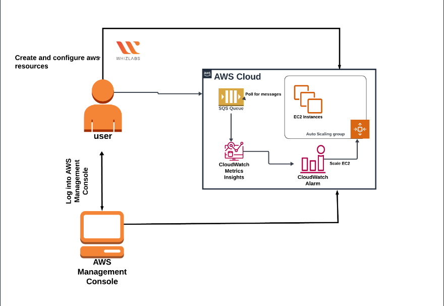

/home/ec2-user/sqs-poller/
├── sqs-poller.sh          # Main poller script
├── process-message.sh     # Message processing logic
├── install.sh             # One-time setup script
└── logs/
    ├── poller.log
    └── error.log

